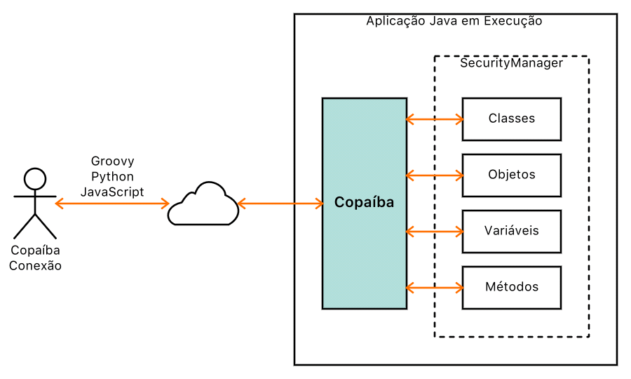

# Copaíba

Programação em tempo de execução remota.

Programming in remote runtime.

## Descrição

A Copaíba é um projeto composto por protocolos e ferramentas que permite a manipulação de classes/objetos Java remotos através de scripts escritos em Groovy, Python, JavaScript e outras linguagens. Grande parte da manipulação é feita através de [reflexão](https://docs.oracle.com/javase/tutorial/reflect/).

A figura a seguir ilustra o esquema geral da arquitetura Copaíba:



## Versão Atual

1.0-A14

Padrão de versionamento: [JFV](http://joseflavio.com/jfv)

## Como Usar

A Copaíba está disponível como biblioteca Java no repositório [Maven](http://search.maven.org/#artifactdetails%7Ccom.joseflavio%7Ccopaiba%7C1.0-A14%7Cjar).

Gradle:

```
compile 'com.joseflavio:copaiba:1.0-A14'
```

Maven:

```xml
<dependency>
    <groupId>com.joseflavio</groupId>
    <artifactId>copaiba</artifactId>
    <version>1.0-A14</version>
</dependency>
```

### Requisitos para uso

* Java >= 1.8

## Documentação

A documentação da Copaíba, no formato **Javadoc**, está disponível em:

[http://joseflavio.com/copaiba/javadoc](http://joseflavio.com/copaiba/javadoc)

## Desenvolvimento

Configuração do projeto para Eclipse e IntelliJ IDEA:

```sh
gradle eclipse
gradle cleanIdea idea
```

### Requisitos para desenvolvimento

* Git >= 2.8
* Java >= 1.8
* Gradle >= 4.7

### Testes

Os testes [JUnit](https://junit.org/junit4/) estão localizados no pacote `com.joseflavio.copaiba.teste` da biblioteca Copaíba, sendo [com.joseflavio.copaiba.teste.CopaibaTestes](https://github.com/joseflaviojr/copaiba/blob/master/fonte/com/joseflavio/copaiba/teste/CopaibaTestes.java) a classe central dos testes.

## Compilação

Para compilar o projeto, gerando os arquivos JAR, executar no terminal:

```sh
gradle clean build
```

## Publicação

Para compilar e publicar os arquivos finais do projeto no repositório [Maven](http://search.maven.org/#artifactdetails%7Ccom.joseflavio%7Ccopaiba%7C1.0-A14%7Cjar), executar no terminal:

```sh
gradle clean uploadArchives
```

## Licença

### Português

Direitos Autorais Reservados &copy; 2016-2019 [José Flávio de Souza Dias Júnior](http://joseflavio.com)

Este arquivo é parte de Copaíba - [http://joseflavio.com/copaiba](http://joseflavio.com/copaiba).

Copaíba é software livre: você pode redistribuí-lo e/ou modificá-lo
sob os termos da [Licença Pública Menos Geral GNU](https://www.gnu.org/licenses/lgpl.html) conforme publicada pela
Free Software Foundation, tanto a versão 3 da Licença, como
(a seu critério) qualquer versão posterior.

Copaíba é distribuído na expectativa de que seja útil,
porém, SEM NENHUMA GARANTIA; nem mesmo a garantia implícita de
COMERCIABILIDADE ou ADEQUAÇÃO A UMA FINALIDADE ESPECÍFICA. Consulte a
Licença Pública Menos Geral do GNU para mais detalhes.

Você deve ter recebido uma cópia da Licença Pública Menos Geral do GNU
junto com Copaíba. Se não, veja [https://www.gnu.org/licenses/lgpl.html](https://www.gnu.org/licenses/lgpl.html).

### English

Copyright &copy; 2016-2019 [José Flávio de Souza Dias Júnior](http://joseflavio.com)

This file is part of Copaíba - [http://joseflavio.com/copaiba](http://joseflavio.com/copaiba).

Copaíba is free software: you can redistribute it and/or modify
it under the terms of the [GNU Lesser General Public License](https://www.gnu.org/licenses/lgpl.html) as published by
the Free Software Foundation, either version 3 of the License, or
(at your option) any later version.

Copaíba is distributed in the hope that it will be useful,
but WITHOUT ANY WARRANTY; without even the implied warranty of
MERCHANTABILITY or FITNESS FOR A PARTICULAR PURPOSE. See the
GNU Lesser General Public License for more details.

You should have received a copy of the GNU Lesser General Public License
along with Copaíba. If not, see [https://www.gnu.org/licenses/lgpl.html](https://www.gnu.org/licenses/lgpl.html).
